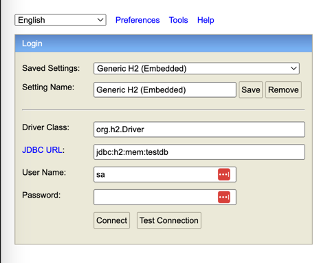
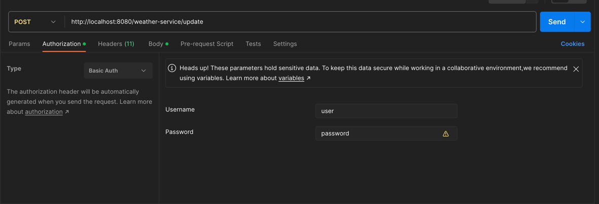

# T8sGm9ZqL3xYp4RjWdN5

<h2>Built with</h2>
Java version 17</br>
maven 3.9.2 </br>
SpringBoot</br>

<h2>Description</h2>
This application has the following 2 responsibilities:
- Receive and persist metrics provided by sensors via a Post request</br>
- Retrieve and query the persisted metrics via Get requests</br>
   
<h3>To start the application</h3> 
- cd into weather-service module and run mvn clean install </br>
- run WeatherServiceApplication located at: src/main/java/com/demo/weather_service/WeatherServiceApplication.java</br>


<h2>Useful links:</h2>
When accessing either of the following links you will likely be prompted for credentials:


The credentials are stored in the local application.properties file,
in a real world scenario I would use a far more robust security approach.

Credentials:
- Username: user
- Password: password


<h3>UI Links</h3>
With the app is running you can access the following:<br>
- Swagger Ui: http://localhost:8080/swagger-ui/index.html#/
- Local H2 DB console: http://localhost:8080/h2-console/

<h3> H2 DB Console credentials</h3> 

- url: jdbc:h2:mem:testdb<br>
- username: sa<br>




This in memory H2 DB is only for local testing/demo purposes, in a real real world scenario this would be replaced with a deployed DB.<br> I have added some data to allow for local testing/demoing, the additions are located:
weather-service/src/main/resources/data.sql

<h2>Requests</h2>
You can test the requests via the Swagger UI or via applications such as Postman/Api Tester<br>
If you decide to use an application you must add the same basic authentication, otherwise you will get a 401 Response

<h3>Credentials</h3>
Username: user</br>
Password: password</br>



<h3>Example Requests</h3>

Retrieve latest state
<br>
http://localhost:8080/weather-service
<br>
Retrieve latest state for sensor
<br>
http://localhost:8080/weather-service/sensor-1
<br>

<h3>Statistic related requests</h3>

The following requests will return the statistics for each sensor as well as an overall statistic, in the event where a from and to date are not provided the statistics will be generated using the latest state of each of the requested sensors</br>
<br>
Retrieve latest state for multiple sensors
<br>
http://localhost:8080/weather-service/sensor-1,sensor-2
<br>
Process statistics using latest state for multiple sensors for single metric when no date provided
<br>
http://localhost:8080/weather-service/sensor-1,sensor-2/temperature/average
<br>
Retrieve average statistics using latest state for multiple sensors for single metric when no date provided<br>
http://localhost:8080/weather-service/sensor-1,sensor-2/temperature,humidity,windspeed/average
<br>
Retrieve sum statistics using latest state for multiple sensors for multiple metrics when no date provided
<br>
http://localhost:8080/weather-service/sensor-1,sensor-2/temperature,humidity,windspeed/sum
<br>
Retrieve statistics for multiple sensors for multiple metrics between 2 dates within a 30 day range
<br>
http://localhost:8080/weather-service/sensor-1,sensor-2/temperature,humidity,windspeed/average?from=2024-07-16&to=2024-07-19
<br>
Get all sensors with multiple metrics, average statistic, with a time range
<br>
http://localhost:8080/weather-service/all-sensors/temperature,humidity,windspeed/average?from=2024-07-16&to=2024-07-19


Example Post Request from sensor
`http://localhost:8080/weather-service/update`
```
{
"sensorId": "sensor-1",
"date": "2024-07-18",
"temperature": 22.0,
"humidity": 60.0,
"windSpeed": 5.0
}
```